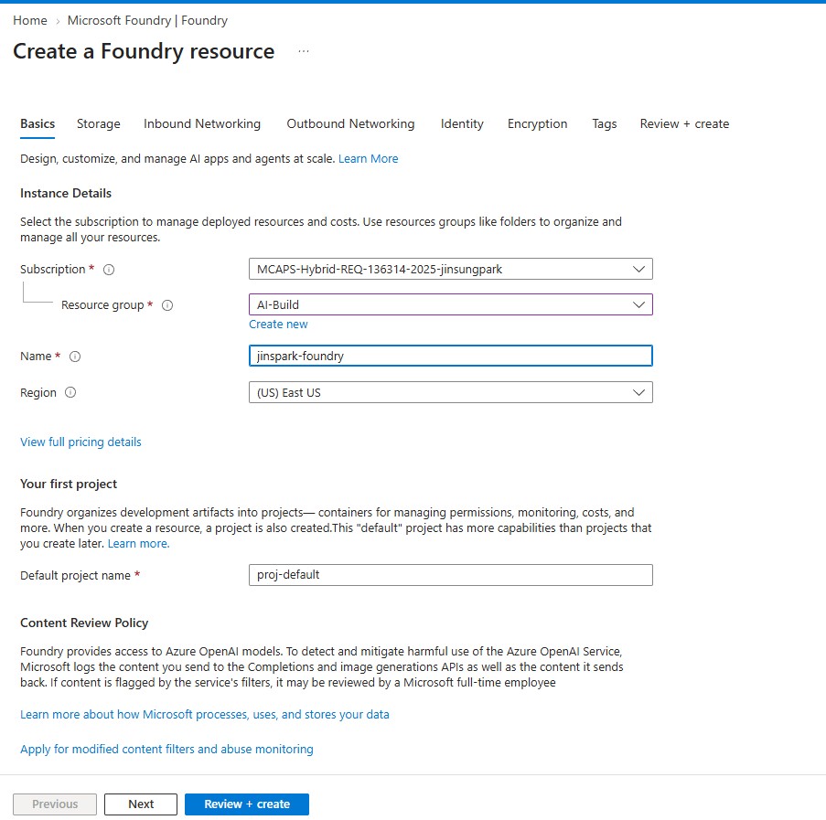
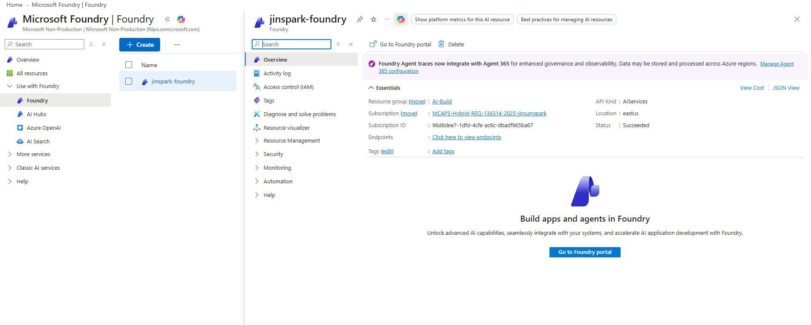
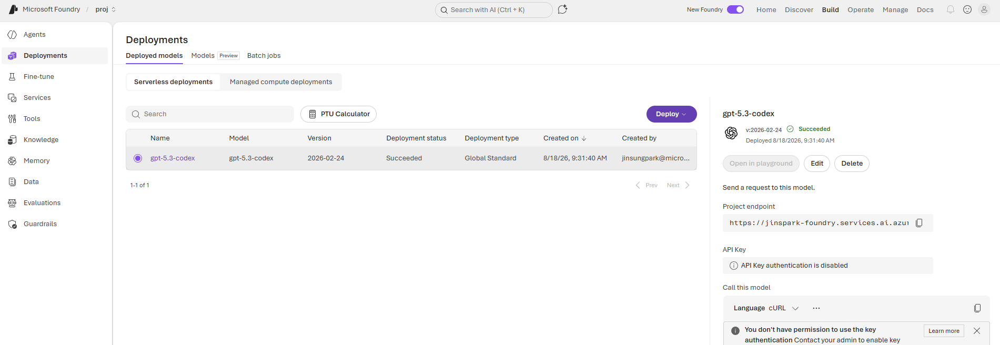

# 모듈 2: Azure Portal에서 Microsoft Foundry 준비

[⬅️ 이전: 아키텍처와 사전 준비](../01-architecture-and-prerequisites/) | [🏠 메인](../README.md) | [➡️ 다음: APIM AI Gateway](../03-apim-gateway/)

## 학습 목표

- Azure Portal에서 Microsoft Foundry 리소스와 첫 번째 프로젝트를 생성합니다.
- Foundry portal에서 Responses API를 지원하는 모델을 배포합니다.
- 리소스 이름, 프로젝트 endpoint 및 모델 배포명을 구분해 기록합니다.
- APIM을 연결하기 전에 모델 배포 상태를 확인합니다.

리소스 프로비저닝 시간을 제외한 예상 실습 시간은 20~30분입니다.

**완료 결과:** Responses API를 지원하는 모델 배포와 APIM 연결에 사용할 리소스 이름·엔드포인트·배포명을 확보합니다.

## 시작하기 전에

다음 항목을 준비합니다.

| 항목 | 설명 |
| --- | --- |
| Azure 구독 | Foundry 리소스를 만들 수 있는 구독 |
| 리소스 그룹 | 기존 그룹을 선택하거나 새로 생성 |
| Azure RBAC 권한 | 리소스 생성과 모델 배포가 가능한 권한 |
| 사용 지역 | 필요한 모델과 배포 유형을 지원하는 Azure 지역 |
| 모델 quota | 선택할 모델을 배포할 수 있는 가용 quota |

모델과 버전, 배포 유형 및 지역별 제공 여부는 계속 변경될 수 있습니다. Azure Portal에 실제로 표시되는 선택지와 조직 정책을 최종 기준으로 사용합니다.

## 2.1 Azure Portal에서 Foundry 리소스 생성



1. [Azure Portal](https://portal.azure.com)에 로그인합니다.
2. 상단 검색창에서 **Microsoft Foundry**를 검색해 서비스를 엽니다.
3. 왼쪽 메뉴에서 **Use with Foundry > Foundry**를 선택합니다.
4. **+ Create**를 선택합니다.
5. **Create a Foundry resource** 화면의 **Basics** 탭에서 다음 값을 입력합니다.

   | Portal 항목 | 설정 |
   | --- | --- |
   | Subscription | 실습에 사용할 Azure 구독 |
   | Resource group | 기존 리소스 그룹을 선택하거나 새로 생성 |
   | Name | 전역에서 고유한 Foundry 리소스 이름 |
   | Region | 사용할 모델과 배포 유형을 지원하는 지역 |
   | Default project name | 첫 번째 프로젝트 이름(예: `proj-codex`) |

리소스 이름은 이후 APIM backend를 식별할 때 사용하고, 프로젝트 이름은 Foundry 안에서 모델과 개발 자산을 구성하는 범위로 사용합니다.

## 2.2 네트워크, Identity 및 보안 설정

생성 마법사의 나머지 탭을 조직 정책에 맞게 검토합니다.

### Storage

기본 설정을 사용하거나 조직에서 지정한 storage 구성을 선택합니다. 고객 관리 storage를 사용하는 경우 접근 권한과 네트워크 연결도 함께 준비해야 합니다.

### Inbound Networking

이 워크숍에서는 APIM 연결을 먼저 검증하기 위해 기본 public access 구성을 사용할 수 있습니다. 운영 환경에서는 조직 정책에 따라 Private Endpoint 또는 선택된 네트워크만 허용하도록 구성합니다.

### Outbound Networking

Foundry 프로젝트에서 외부 서비스나 도구를 호출할 계획이 있다면 outbound 제한과 허용 대상을 확인합니다. 이 워크숍의 기본 모델 호출만 수행할 때에는 기본값으로 진행할 수 있습니다.

### Identity

프로젝트 자체에서 다른 Azure 리소스에 접근해야 하는 경우 system-assigned 또는 user-assigned identity를 구성합니다. APIM이 Foundry 모델을 호출하기 위한 identity는 다음 모듈에서 APIM 리소스에 별도로 활성화합니다.

### Encryption

기본 Microsoft-managed key를 사용하거나 조직 정책에 따라 customer-managed key를 설정합니다. customer-managed key를 선택하면 Key Vault 권한과 네트워크 구성이 추가로 필요합니다.

### 생성 완료

1. 필요하면 **Tags**를 입력합니다.
2. **Review + create**를 선택합니다.
3. 유효성 검사를 통과하면 **Create**를 선택합니다.
4. 배포가 완료되면 **Go to resource**를 선택합니다.
5. **Overview**에서 리소스 이름, region, resource group 및 endpoint 항목을 확인합니다.

## 2.3 Foundry portal 열기



1. 생성한 Foundry 리소스의 **Overview**에서 **Go to Foundry portal**을 선택합니다.
2. 생성 과정에서 지정한 기본 프로젝트가 선택되어 있는지 확인합니다.
3. 다른 프로젝트가 열렸다면 화면 상단의 프로젝트 선택기에서 올바른 프로젝트로 전환합니다.

Azure Portal은 리소스, 네트워크, identity 및 RBAC 같은 Azure 관리 설정에 사용합니다. Foundry portal은 모델 배포, playground, 평가 및 프로젝트 자산 관리에 사용합니다.

## 2.4 Responses API 지원 모델 배포



1. Foundry portal 상단에서 **Build**를 선택합니다.
2. 왼쪽 메뉴에서 **Deployments**를 엽니다.
3. **Deployed models** 탭에서 **Deploy > Deploy base model**을 선택합니다. 포털 버전에 따라 **Models** 탭에서 모델을 선택한 뒤 배포할 수도 있습니다.
4. model catalog에서 Responses API와 Codex 사용 시나리오를 지원하는 모델을 선택합니다.
5. 배포 화면에서 다음 항목을 확인합니다.

   | 항목 | 확인 사항 |
   | --- | --- |
   | Model version | 사용할 기능과 Responses API를 지원하는 버전 |
   | Deployment name | Codex의 `model` 값으로 사용할 고유한 이름 |
   | Deployment type | 지역과 조직 요구 사항에 맞는 유형 |
   | Tokens per Minute | 실습 요청을 처리할 수 있는 quota |
   | Content filter | 조직 정책에 맞는 필터 |

6. **Deploy**를 선택합니다.
7. **Deployed models** 목록에서 **Deployment status**가 `Succeeded`가 될 때까지 기다립니다.

예를 들어 model catalog의 모델 이름과 실제 deployment name은 다음처럼 다를 수 있습니다.

| 구분 | 예시 |
| --- | --- |
| Model | `gpt-5-codex` |
| Deployment name | `gpt-codex-prod` |

이 경우 Codex와 REST 요청의 `model`에는 반드시 deployment name을 사용합니다.

```toml
model = "gpt-codex-prod"
```

## 2.5 연결 정보 기록

배포된 모델을 선택하고 세부 정보에서 다음 값을 기록합니다.

| 값 | 찾는 위치 | 다음 모듈에서의 용도 |
| --- | --- | --- |
| Foundry resource name | Azure Portal의 Foundry **Overview** | APIM에서 AI Service 선택 및 backend 식별 |
| Project name | Foundry portal 상단 프로젝트 선택기 | 올바른 프로젝트 확인 |
| Project endpoint | 배포 상세 화면 | 프로젝트 연결 정보 확인 |
| Deployment name | **Deployments > Deployed models** | 요청 body의 `model` 값 |

Project endpoint는 일반적으로 다음과 같은 형식으로 표시됩니다.

```text
https://YOUR_RESOURCE_NAME.services.ai.azure.com/...
```

Azure OpenAI 호환 v1 endpoint는 배포의 **Call this model** 예제 또는 endpoint 정보에서 확인하며 일반적으로 다음 계약을 사용합니다.

```text
https://YOUR_RESOURCE_NAME.openai.azure.com/openai/v1/
```

> **Project endpoint와 Azure OpenAI v1 endpoint를 혼용하지 마세요.** 다음 모듈에서는 APIM의 Microsoft AI Foundry 연결 마법사가 리소스와 올바른 model route를 선택합니다. 수동 policy를 사용할 때에는 실제 리소스에 표시되는 Azure OpenAI 호환 endpoint를 기준으로 합니다.

API key가 비활성화되어 있거나 사용자에게 key 조회 권한이 없어도 이 워크숍을 진행할 수 있습니다. 최종 구성에서는 APIM의 Managed Identity가 Foundry backend에 인증하므로 Foundry API key를 Codex 사용자에게 배포하지 않습니다.

## 2.6 APIM 연결을 위한 권한 계획

APIM 리소스는 다음 모듈에서 생성하므로 이 단계에서는 역할을 아직 할당하지 않습니다. APIM 생성 후 다음 순서로 구성합니다.

1. APIM의 system-assigned Managed Identity를 활성화합니다.
2. 이 Foundry/Azure OpenAI 리소스의 **Access control (IAM)**을 엽니다.
3. APIM identity에 모델 추론이 가능한 최소 역할을 할당합니다.

Azure OpenAI 모델 추론에는 일반적으로 **Cognitive Services OpenAI User** 역할을 사용합니다. 실제 리소스 종류와 조직의 custom role 정책에 따라 역할 이름이 다를 수 있으므로 허용된 최소 권한을 확인합니다.

## 2.7 선택 사항: 모델 배포 확인

Foundry portal에서 배포를 선택했을 때 playground가 활성화되어 있으면 간단한 prompt를 보내 모델이 응답하는지 확인합니다. API key 인증이 비활성화되어 있거나 playground 사용 권한이 없는 환경에서는 이 단계를 건너뛰고 모듈 3의 APIM Portal Test로 검증합니다.

직접 REST 호출이 조직 정책상 허용되는 경우에는 배포 상세 화면의 **Call this model**에서 제공하는 코드 예제를 사용합니다. endpoint, 인증 방식 및 API 계약은 화면에 생성된 예제를 그대로 따르고 credential을 source code나 문서에 저장하지 않습니다.

## 문제 해결

| 증상 | 확인 사항 |
| --- | --- |
| 원하는 모델이 보이지 않음 | 선택한 region의 모델 제공 여부와 구독 접근 권한 |
| 배포가 quota 오류로 실패 | deployment type별 quota와 기존 배포 사용량 |
| 배포 상태가 오래 Pending | Azure Service Health, region capacity 및 activity log |
| 프로젝트가 보이지 않음 | 현재 tenant, 구독, RBAC 및 프로젝트 선택기 |
| API key를 조회할 수 없음 | local authentication 설정과 key 조회 권한; APIM Managed Identity 사용 시 key 불필요 |
| APIM에서 리소스가 보이지 않음 | APIM과 Foundry의 tenant, 구독 접근 권한 및 지원 region/리소스 종류 |

## 체크포인트

- [ ] Azure Portal에서 Microsoft Foundry 리소스를 생성했다.
- [ ] 기본 프로젝트가 생성되고 Foundry portal에서 열리는 것을 확인했다.
- [ ] Responses API를 지원하는 모델을 배포했다.
- [ ] 모델 이름과 deployment name을 구분해 기록했다.
- [ ] deployment status가 `Succeeded`이다.
- [ ] Foundry resource name, project name 및 endpoint를 기록했다.
- [ ] Foundry API key를 Codex 사용자에게 배포하지 않는 인증 구조를 확인했다.
- [ ] APIM Managed Identity의 역할 할당은 모듈 3에서 수행할 것을 확인했다.

## 참고 자료

- [Microsoft Learn: What is Microsoft Foundry?](https://learn.microsoft.com/azure/ai-foundry/what-is-foundry)
- [Microsoft Learn: Create a project in Microsoft Foundry](https://learn.microsoft.com/azure/ai-foundry/how-to/create-projects)
- [Microsoft Learn: Deploy models in Microsoft Foundry](https://learn.microsoft.com/azure/ai-foundry/how-to/deploy-models-openai)
- [Microsoft Learn: Use the Azure OpenAI Responses API](https://learn.microsoft.com/azure/foundry/openai/how-to/responses)
- [Microsoft Learn: Role-based access control for Microsoft Foundry](https://learn.microsoft.com/azure/ai-foundry/concepts/rbac-foundry)

[⬅️ 이전: 아키텍처와 사전 준비](../01-architecture-and-prerequisites/) | [🏠 메인](../README.md) | [➡️ 다음: APIM AI Gateway](../03-apim-gateway/)
