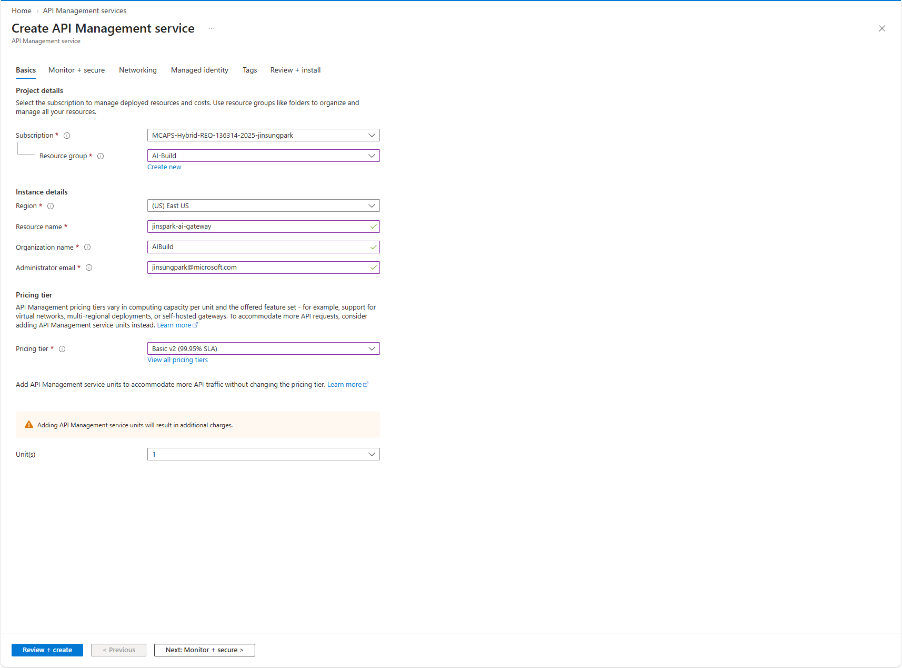
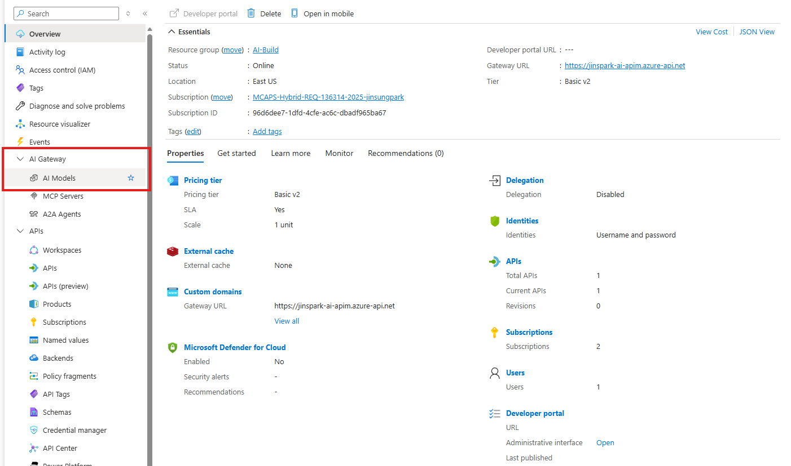
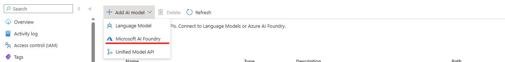
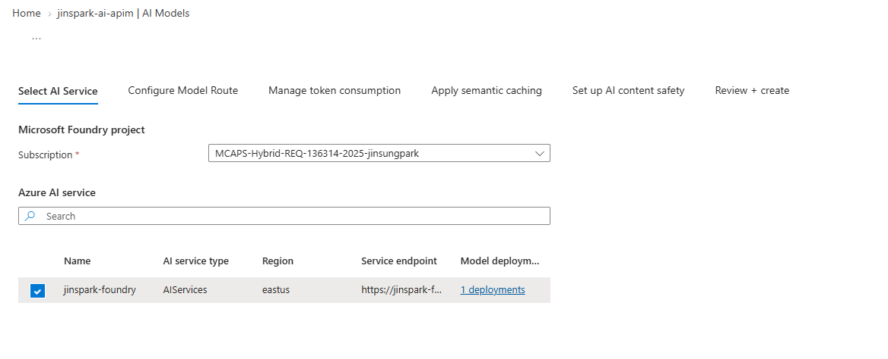
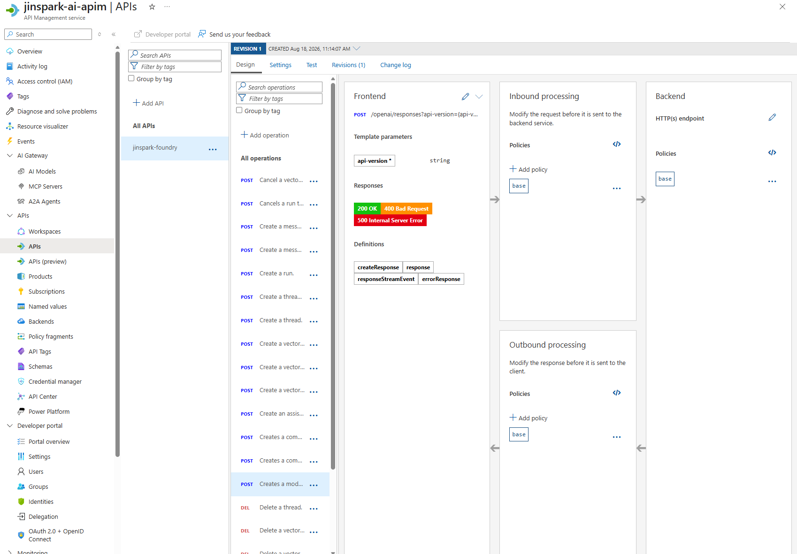
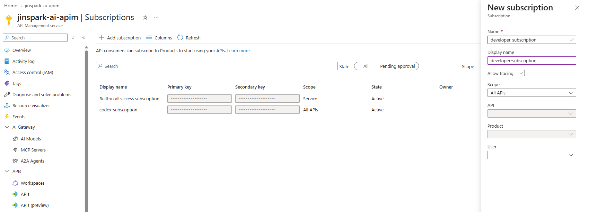

# 모듈 3: Azure Portal에서 APIM AI Gateway 구성

[⬅️ 이전: Foundry 모델 준비](../02-foundry-model/) | [🏠 메인](../README.md) | [➡️ 다음: Codex 설정](../04-codex-configuration/)

## 학습 목표

- Azure Portal에서 API Management(APIM) 인스턴스를 생성합니다.
- Codex 전용 Responses API와 operation을 포털에서 구성합니다.
- APIM subscription과 Managed Identity를 서로 다른 인증 계층으로 구성합니다.
- SSE streaming을 보존하는 policy를 적용하고 호출을 검증합니다.

APIM 프로비저닝 시간을 제외한 예상 실습 시간은 30~40분입니다. 새 인스턴스 생성은 계층과 지역에 따라 수십 분 이상 걸릴 수 있습니다.

**완료 결과:** Codex가 호출할 `POST /codex/openai/v1/responses` 엔드포인트와 APIM subscription key를 확보하고, REST·SSE 호출을 검증합니다.

진행 순서는 **APIM 생성 → Managed Identity와 RBAC → 모델 route → 정책 → product와 key → 호출 검증**입니다.

## 시작하기 전에

| 준비할 값 | 예시 | 용도 |
| --- | --- | --- |
| Azure 구독 | `Contoso-Workshop` | APIM을 만들 구독 |
| 리소스 그룹 | `rg-codex-workshop` | APIM 리소스 배치 |
| APIM 서비스 이름 | `apim-codex-contoso` | 전역에서 고유한 gateway 이름 |
| Foundry/Azure OpenAI 리소스 이름 | `aoai-contoso` | backend URL 구성 |
| 모델 배포명 | `gpt-codex-prod` | 요청의 `model` 값 |

Foundry backend URL은 `https://YOUR_RESOURCE_NAME.openai.azure.com` 형식이어야 합니다.

## 3.1 Azure Portal에서 APIM 인스턴스 생성



1. [Azure Portal](https://portal.azure.com)에 로그인합니다.
2. 상단 검색창에서 **API Management services**를 검색해 엽니다.
3. **Create**를 선택합니다.
4. **Basics** 탭에서 다음 값을 입력합니다.

   | Portal 항목 | 설정 |
   | --- | --- |
   | Subscription | 실습에 사용할 Azure 구독 |
   | Resource group | 기존 리소스 그룹을 선택하거나 새로 생성 |
   | Region | 조직 정책과 backend 위치를 고려한 지원 지역 |
   | Resource name | 전역에서 고유한 APIM 이름 |
   | Organization name | 조직 또는 워크숍 이름 |
   | Administrator email | 알림을 받을 유효한 이메일 주소 |
   | Pricing tier | 실습은 `Basic v2`, 운영은 조직 요구 사항에 맞는 계층 |

   > 이 가이드는 AI Gateway 메뉴를 제공하는 **Basic v2**를 기준으로 합니다. 운영 환경에서는 용량, 가용 영역, 네트워크 및 SLA 요구 사항에 맞는 계층을 선택하세요. 지역과 계층에 따라 제공 기능이 다를 수 있습니다.

5. 이 실습에서는 **Networking** 탭의 기본 공용 네트워크 구성을 사용합니다. Private Endpoint, VNet 또는 public network 차단이 필요한 조직에서는 승인된 설정을 적용합니다.
6. **Managed identity** 탭에서 system-assigned managed identity를 활성화합니다. 생성 화면에서 활성화하지 못했다면 3.2에서 설정할 수 있습니다.
7. **Review + create**에서 유효성 검사를 통과한 뒤 **Create**를 선택합니다.
8. 배포가 완료되면 **Go to resource**를 선택합니다.
9. APIM **Overview**에서 **Gateway URL**을 기록합니다.

서비스 이름이 `apim-codex-contoso`이면 기본 gateway URL은 다음과 같습니다.

```text
https://apim-codex-contoso.azure-api.net
```

이후 `YOUR_APIM_HOST`에는 `https://`를 제외한 호스트 이름을 사용합니다.

## 3.2 System-assigned Managed Identity 활성화

APIM이 key 없이 Foundry backend를 호출하도록 Managed Identity를 활성화합니다.

1. APIM 왼쪽 메뉴에서 **Security > Managed identities** 또는 **Identity**를 엽니다.
2. **System assigned** 탭의 **Status**를 **On**으로 변경합니다.
3. **Save**를 선택하고 확인 메시지에 동의합니다.
4. 생성된 **Object (principal) ID**를 기록합니다.

이어서 Foundry/Azure OpenAI 리소스에 추론 권한을 부여합니다.

1. Azure Portal에서 이전 모듈에서 준비한 Foundry/Azure OpenAI 리소스를 엽니다.
2. **Access control (IAM) > Add > Add role assignment**를 선택합니다.
3. 모델 추론 호출이 가능한 최소 역할을 선택합니다. Azure OpenAI 리소스에서는 일반적으로 **Cognitive Services OpenAI User**를 사용합니다.
4. **Members**에서 **Managed identity**를 선택하고 **Select members**를 누릅니다.
5. Managed identity 종류에서 **API Management service**를 선택하고 방금 생성한 APIM을 지정합니다.
6. **Review + assign**을 선택합니다.

역할 할당 전파에는 몇 분이 걸릴 수 있습니다. 처음 호출에서 `401` 또는 `403`이 발생하면 identity가 올바른 backend 리소스에 할당되었는지 확인하고 잠시 후 다시 시도합니다.

## 3.3 AI Gateway에서 Foundry 모델 연결



최신 Azure Portal의 AI Gateway 마법사를 사용하면 Foundry 모델과 API route를 함께 만들 수 있습니다.

1. APIM 왼쪽 메뉴에서 **AI Gateway > AI Models**를 엽니다.
2. **+ Add AI model**을 선택하고 **Microsoft AI Foundry**를 선택합니다.



3. **Select AI Service**에서 Foundry 리소스가 속한 Azure 구독을 선택합니다.
4. 목록에서 이전 모듈에서 준비한 Foundry/Azure OpenAI 리소스를 선택합니다.

   

5. 필요한 경우 **Model deployments** 링크에서 사용할 배포가 맞는지 확인한 뒤 다음 단계로 이동합니다.
6. **Configure Model Route**에서 다음 값을 입력합니다.

   | Portal 항목 | 값 |
   | --- | --- |
   | Display name | `Codex Foundry Gateway` |
   | Name | `codex-foundry-gateway` |
   | Base path | `codex` |
   | Products | 이 단계에서는 비워 두어도 됨 |
   | Client compatibility | `Azure OpenAI v1` |

   > **중요:** `Azure OpenAI`와 `Azure OpenAI v1`은 서로 다른 계약입니다. Codex가 `/responses`를 호출하고 URL에 `api-version`을 붙이지 않도록 반드시 **Azure OpenAI v1**을 선택합니다.

7. 화면에 표시되는 route가 다음 형식인지 확인합니다.

   ```text
   https://YOUR_APIM_HOST/codex/openai/v1
   ```

8. **Manage token consumption**, **Apply semantic caching**, **Set up AI content safety** 단계는 우선 기본값으로 둡니다. 연결 검증 후 조직 정책에 따라 활성화합니다.
9. **Review + create**에서 선택한 Foundry 리소스, route 및 `Azure OpenAI v1` 호환성을 다시 확인하고 **Create**를 선택합니다.

### 생성된 API 확인



1. **APIs > APIs**에서 `Codex Foundry Gateway`를 엽니다.
2. **Design** 탭의 operation 목록에 Responses API operation이 생성되었는지 확인합니다.
3. **Settings** 탭에서 **Subscription required**를 선택하고 저장합니다.
4. Responses operation의 frontend가 `POST /responses`인지 확인합니다.

완성된 공개 endpoint는 다음과 같습니다.

```text
POST https://YOUR_APIM_HOST/codex/openai/v1/responses
```

## 3.4 Portal에서 backend 인증 policy 확인

AI Gateway 마법사가 생성한 API에는 backend route와 인증 policy가 포함될 수 있습니다. 먼저 생성된 policy를 확인하고, 필요한 경우 저장소의 policy 템플릿으로 명시적으로 구성합니다.

1. 생성한 API의 **Design** 탭을 엽니다.
2. **All operations**를 선택합니다.
3. **Inbound processing** 영역의 `</>` 아이콘을 선택해 policy code editor를 엽니다.
4. backend URL, `/openai/v1` route 및 Managed Identity 인증이 올바르게 생성되었는지 확인합니다.
5. 이 워크숍의 고정 policy를 사용하려면 기존 내용을 [APIM policy 템플릿](../templates/apim-policy.xml)의 전체 내용으로 교체합니다.
6. 템플릿의 `YOUR_RESOURCE_NAME`을 실제 Foundry/Azure OpenAI 리소스 이름으로 변경합니다.
7. **Save**를 선택합니다.

핵심 policy는 다음과 같습니다.

```xml
<set-backend-service base-url="https://YOUR_RESOURCE_NAME.openai.azure.com" />
<rewrite-uri template="/openai/v1/responses" copy-unmatched-params="false" />
<authentication-managed-identity
  resource="https://ai.azure.com"
  output-token-variable-name="foundry-token"
  ignore-error="false" />
<set-header name="Authorization" exists-action="override">
  <value>@("Bearer " + (string)context.Variables["foundry-token"])</value>
</set-header>
```

전체 템플릿은 공개 path rewrite, Managed Identity token 획득, backend `Authorization` 설정, client key 제거 및 SSE 응답의 비버퍼링 전달을 수행합니다.

> 현재 Foundry OpenAI v1 계약은 `https://ai.azure.com` resource를 사용합니다. 기존 Azure OpenAI 리소스가 Cognitive Services audience를 요구하면 `resource`를 `https://cognitiveservices.azure.com`으로 변경합니다. 실제 backend 계약에 맞는 하나만 사용하세요.

## 3.5 Product와 subscription key 생성



APIM subscription은 client에서 APIM으로 들어오는 요청을 인증합니다. 이 key는 APIM이 Foundry에 인증할 때 사용하는 Managed Identity와 별개입니다.

### Product 생성 및 API 연결

1. APIM 왼쪽 메뉴에서 **Products**를 엽니다.
2. **+ Add**를 선택하고 다음 값을 입력합니다.

   | Portal 항목 | 권장 값 |
   | --- | --- |
   | Display name | `Codex Workshop` |
   | Id | `codex-workshop` |
   | Description | `Product for Codex Foundry gateway clients` |
   | Requires subscription | 선택 |
   | Requires approval | 실습에서는 선택하지 않음 |
   | State | `Published` |

3. 생성한 product를 열고 **APIs > + Add**를 선택합니다.
4. `Codex Foundry Gateway` API를 선택한 뒤 **Select**를 누릅니다.

### Subscription 발급

1. APIM 왼쪽 메뉴에서 **Subscriptions**를 엽니다.
2. **+ Add subscription**을 선택합니다.
3. 이름을 `codex-workshop-client`로 입력합니다.
4. **Scope**에서 **Product**를 선택하고 `Codex Workshop`을 지정합니다.
5. 필요한 경우 owner를 선택한 뒤 **Create**를 누릅니다.
6. 생성된 subscription에서 **Show/hide keys**를 선택하고 primary key를 복사합니다.

key는 비밀로 취급하며 문서, source code, Git 저장소 또는 채팅에 붙여 넣지 않습니다.

## 3.6 Portal에서 기본 호출 확인

1. **APIs > APIs**에서 `Codex Foundry Gateway`를 엽니다.
2. **Test** 탭에서 `Create model response` operation을 선택합니다.
3. `Ocp-Apim-Subscription-Key` header에 발급한 key를 입력합니다. Portal이 subscription 선택 UI를 제공하면 `Codex Workshop`의 subscription을 선택합니다.
4. `Content-Type: application/json` header를 확인합니다.
5. Request body에 다음 JSON을 입력합니다. 배포명은 실제 값으로 변경합니다.

   ```json
   {
     "model": "YOUR_DEPLOYMENT_NAME",
     "input": "Reply with APIM_OK.",
     "stream": false
   }
   ```

6. **Send**를 선택합니다.

`200 OK`와 정상 JSON이 반환되면 기본 연결이 완료된 것입니다. 실패하면 Test 결과의 trace에서 다음을 확인합니다.

| 구간 | 확인 사항 |
| --- | --- |
| Client → APIM | subscription key가 있고 product가 API에 연결됨 |
| APIM inbound | subscription 검증과 policy 실행 성공 |
| APIM → Foundry | Managed Identity token 획득 성공 |
| Backend URL | `/openai/v1/responses`로 rewrite됨 |
| Request body | `model`이 실제 배포명과 일치 |
| Backend response | `200`, 또는 원인을 나타내는 `401`/`403`/`404` |

포털에 trace 옵션이 없으면 APIM의 **Diagnose and solve problems**와 Application Insights 진단 설정을 사용합니다. 인증 token, subscription key, prompt 또는 응답 본문이 로그에 남지 않도록 주의합니다.

## 3.7 PowerShell에서 REST 및 SSE smoke test

Portal 테스트가 성공하면 현재 PowerShell 프로세스에 APIM key를 임시로 설정합니다.

```powershell
$env:CODEX_APIM_SUBSCRIPTION_KEY = 'YOUR_APIM_SUBSCRIPTION_KEY'
```

일반 JSON 응답을 확인합니다.

```powershell
$headers = @{
    'Ocp-Apim-Subscription-Key' = $env:CODEX_APIM_SUBSCRIPTION_KEY
    'Content-Type'              = 'application/json'
}

$body = @{
    model  = 'YOUR_DEPLOYMENT_NAME'
    input  = 'Reply with APIM_OK.'
    stream = $false
} | ConvertTo-Json

Invoke-RestMethod `
    -Method Post `
    -Uri 'https://YOUR_APIM_HOST/codex/openai/v1/responses' `
    -Headers $headers `
    -Body $body
```

이어서 SSE streaming이 버퍼링되지 않는지 확인합니다. `curl.exe -N`은 수신 데이터를 도착하는 즉시 출력합니다.

```powershell
$streamBody = @{
    model  = 'YOUR_DEPLOYMENT_NAME'
    input  = 'Count from one to five, one number at a time.'
    stream = $true
} | ConvertTo-Json -Compress

$streamBody | curl.exe -N `
    -X POST `
    'https://YOUR_APIM_HOST/codex/openai/v1/responses' `
    -H "Ocp-Apim-Subscription-Key: $env:CODEX_APIM_SUBSCRIPTION_KEY" `
    -H 'Content-Type: application/json' `
    -H 'Accept: text/event-stream' `
    --data-binary '@-'
```

SSE event가 생성되는 동안 순차적으로 보여야 하며 마지막에 `response.completed`가 도착해야 합니다. 완료 후 환경 변수에서 key를 제거할 수 있습니다.

```powershell
Remove-Item Env:CODEX_APIM_SUBSCRIPTION_KEY
```

## 3.8 운영 환경에서 추가할 항목

기본 연결을 검증한 뒤 다음 항목을 조직 요구 사항에 따라 추가합니다.

- subscription 또는 사용자별 token rate limit
- request ID와 correlation ID 기록
- token metric을 Azure Monitor로 전송
- backend pool과 circuit breaker
- Private Endpoint, VNet 및 public network access 제한
- prompt/response content를 제외한 메타데이터 로깅

콘텐츠 로깅은 source code와 prompt를 수집할 수 있으므로 기본적으로 비활성화합니다. 필요한 경우 보안, 개인정보 및 데이터 보존 승인을 먼저 받습니다.

## 체크포인트

- [ ] Azure Portal에서 APIM 인스턴스를 생성하고 Gateway URL을 기록했다.
- [ ] APIM의 system-assigned Managed Identity를 활성화했다.
- [ ] Managed Identity에 Foundry/Azure OpenAI 추론 권한을 부여했다.
- [ ] `POST /codex/openai/v1/responses` operation을 생성했다.
- [ ] API가 APIM subscription을 요구한다.
- [ ] Product에 API를 연결하고 client subscription을 발급했다.
- [ ] public path가 Foundry v1 path로 rewrite된다.
- [ ] Portal Test와 PowerShell REST 호출이 성공한다.
- [ ] SSE event가 순차적으로 도착하고 `response.completed`로 끝난다.
- [ ] subscription key와 backend credential이 로그 또는 backend에 노출되지 않는다.

## 참고 자료

- [Microsoft Learn: Create an API Management service instance](https://learn.microsoft.com/azure/api-management/get-started-create-service-instance)
- [Microsoft Learn: Import and publish your first API](https://learn.microsoft.com/azure/api-management/import-and-publish)
- [Microsoft Learn: Create and publish a product](https://learn.microsoft.com/azure/api-management/api-management-howto-add-products)
- [Microsoft Learn: Use managed identities in API Management](https://learn.microsoft.com/azure/api-management/api-management-howto-use-managed-service-identity)
- [Microsoft Learn: Authenticate with managed identity policy](https://learn.microsoft.com/azure/api-management/authentication-managed-identity-policy)
- [Microsoft Learn: AI gateway capabilities in APIM](https://learn.microsoft.com/azure/api-management/genai-gateway-capabilities)
- [Microsoft Learn: Use the Azure OpenAI Responses API](https://learn.microsoft.com/azure/foundry/openai/how-to/responses)

[⬅️ 이전: Foundry 모델 준비](../02-foundry-model/) | [🏠 메인](../README.md) | [➡️ 다음: Codex 설정](../04-codex-configuration/)
