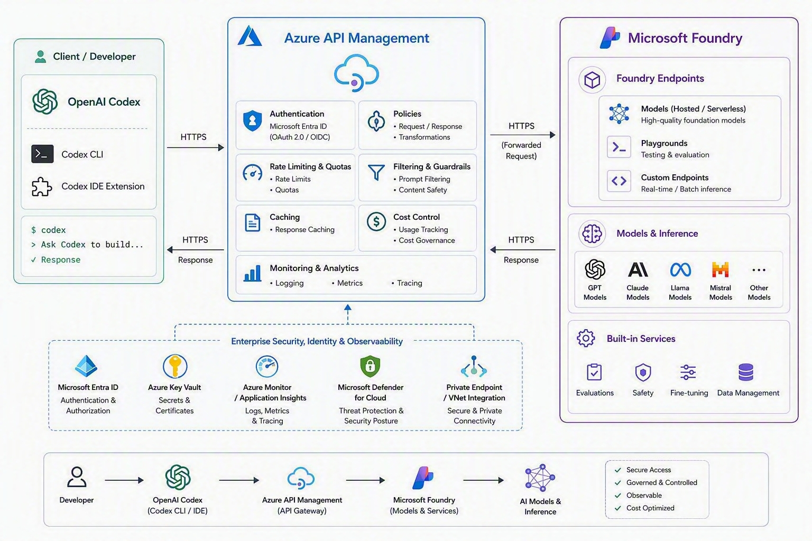

# Codex + Microsoft Foundry Workshop

> 워크샵에서는 Codex CLI를 Azure API Management(APIM)를 통해 Microsoft Foundry의 OpenAI 호환 Responses API에 연결하는 실습형 가이드를 제공합니다.



OpenAI 의 Codex 를 Microsoft Foundry 기반의 Azure Stack 에 통합시킴으로서 Enterprise Level 의 Security 및 Governance 를 통합해서 구성할 수 있습니다.

워크샵에서는 실습을 위한 최소한의 기술 스택에 집중합니다. Production 환경을 염두한다면 05-production-checklist 항목을 참고해보시고, 설정에 어려움이 있으신 경우 언제든 mcapskr-ent-stu-build@microsoft.com 으로 연락 부탁드립니다.


## 워크숍 목표

완료하면 다음을 할 수 있습니다.

- Foundry에서 Responses API를 지원하는 모델 배포를 식별합니다.
- APIM을 Codex 전용 AI Gateway로 구성합니다.
- Codex의 사용자 전역 `config.toml`에 사용자 지정 model provider를 등록합니다.
- 비밀을 파일에 저장하지 않고 환경 변수로 전달합니다.
- REST와 Codex CLI 양쪽에서 연결을 검증하고 오류 지점을 분리합니다.
- APIM에서 인증, 제한, 관측 가능성의 운영 기준을 적용합니다.

## 대상

| 역할 | 권장 모듈 | 관심사 |
| --- | --- | --- |
| 개발자 / Codex 사용자 | 1, 4, 5 | Codex 설정과 연결 확인 |
| 플랫폼 엔지니어 | 1~5 | Foundry, APIM, 배포 표준화 |
| Azure 관리자 | 2, 3, 5 | RBAC, Managed Identity, 모니터링 |
| 보안 / 거버넌스 담당자 | 1, 3, 5 | 비밀 관리, 접근 제어, 감사 |

## 예상 시간과 준비물

- 예상 시간: 약 80~110분
- Windows PowerShell 7 또는 Windows PowerShell 5.1
- 설치된 Codex CLI
- Microsoft Foundry에서 모델을 배포할 권한
- APIM API와 정책을 편집할 권한
- APIM Managed Identity에 역할을 부여할 권한
- 실습용 APIM subscription key

> 이 워크숍은 Windows 기준입니다. macOS/Linux에서는 환경 변수와 경로 표기만 셸에 맞게 바꾸면 Codex 설정 원리는 같습니다.

## 워크숍 구성

| # | 모듈 | 결과물 | 난이도 |
| --- | --- | --- | --- |
| 1 | [아키텍처와 사전 준비](./01-architecture-and-prerequisites/) | 연결 계약과 입력값 시트 | ⭐ |
| 2 | [Foundry 모델 준비](./02-foundry-model/) | Responses API가 동작하는 배포 | ⭐⭐ |
| 3 | [APIM AI Gateway 구성](./03-apim-gateway/) | `/codex/openai/v1/responses` 엔드포인트 | ⭐⭐⭐ |
| 4 | [Codex 연결 설정](./04-codex-configuration/) | 사용자 전역 provider와 선택 프로필 | ⭐⭐ |
| 5 | [Production 전환 체크리스트](./05-production-checklist/) | 회원, 인증, 관측, 보안, 거버넌스 운영 기준 | ⭐⭐⭐ |

권장 순서는 1 → 2 → 3 → 4 → 5입니다. Foundry와 APIM이 이미 준비되어 있다면 1 → 4 → 5만 진행해도 됩니다.

## 워크숍에서 사용하는 요청 계약

새 구성은 API 버전이 URL에 포함되는 Foundry OpenAI v1 endpoint를 기준으로 합니다.

```http
POST https://APIM_HOST/codex/openai/v1/responses
Ocp-Apim-Subscription-Key: APIM_SUBSCRIPTION_KEY
Content-Type: application/json
```

Codex에는 `/responses`를 제외한 다음 값을 `base_url`로 지정합니다.

```text
https://APIM_HOST/codex/openai/v1
```

기존 APIM이 `?api-version=...` 계약을 사용한다면 [모듈 4의 Preview 계약](./04-codex-configuration/#기존-preview-api-version-계약)을 사용합니다. 두 계약을 한 설정에서 섞지 않습니다.

## 빠른 완료 기준

- [ ] Foundry 배포명이 기록되어 있다.
- [ ] APIM의 Managed Identity가 Foundry 모델 호출 권한을 가진다.
- [ ] APIM에 `POST /codex/openai/v1/responses` operation이 있다.
- [ ] REST smoke test가 SSE 또는 정상 JSON 응답을 반환한다.
- [ ] `%USERPROFILE%\.codex\config.toml`에 `foundry_apim` provider가 있다.
- [ ] APIM subscription key는 환경 변수에만 있다.
- [ ] `codex exec`가 Foundry 배포를 통해 응답한다.
- [ ] Production 전환 항목의 담당자와 승인자가 지정되어 있다.

## 템플릿

- [Codex 설정 템플릿](./templates/config.toml.example)
- [APIM 정책 템플릿](./templates/apim-policy.xml)

## 참고 자료

- [OpenAI Docs: Codex configuration reference](https://developers.openai.com/codex/config-reference)
- [OpenAI Docs: Codex advanced configuration](https://developers.openai.com/codex/config-advanced)
- [Microsoft Learn: Azure OpenAI Responses API](https://learn.microsoft.com/azure/foundry/openai/how-to/responses)
- [Microsoft Learn: AI gateway capabilities in API Management](https://learn.microsoft.com/azure/api-management/genai-gateway-capabilities)

문서는 2026-08-27에 확인한 공식 문서를 기준으로 합니다. 지원 모델, 지역, 역할 이름, API 계약은 Azure 리소스 유형과 배포 시점에 따라 달라질 수 있으므로 실제 Foundry endpoint와 APIM operation을 최종 기준으로 삼으세요.
